<div align="center">


# 🏪 Dahab Store — Sales Management System

**A full-featured store management system built with Flutter + Supabase**

[](https://flutter.dev)
[](https://supabase.com)
[](https://dart.dev)
[](.)
[](.)

> A comprehensive sales management system for daily operations — tracking sales, inventory, suppliers, employees, and financial reports. Built with **Clean Architecture + MVI (Cubit)** and powered by **Supabase** as a real-time backend.

</div>

---

## 📋 Table of Contents

- [Overview](#-overview)
- [Key Features](#-key-features)
- [Screenshots](#-screenshots)
- [Technical Architecture](#-technical-architecture)
- [Database Design](#-database-design)
- [Tech Stack](#-tech-stack)
- [Development Team](#-development-team)

---

## 🌟 Overview

**Dahab Store** is a production-grade sales management system designed for modern retail businesses. It provides real-time tracking of all sales, purchases, and expenses — with full multi-currency support (EGP, USD, EUR) and one-click PDF & Excel report exports.

The system is built using **Clean Architecture + MVI** with **Cubit** for state management, and relies on **Supabase** as a fully managed backend — enabling instant data sync across multiple devices and users simultaneously.

**Highlights:**
- 🔄 Real-time data sync via Supabase Realtime
- 🌍 Multi-currency support (EGP, USD, EUR, SAR)
- 📤 PDF & Excel export for all major reports
- 🔐 Role-based access control (Admin / Employee)
- 📊 Advanced financial analytics with charts
- 💼 Partner profit distribution system

---

## ✨ Key Features

| Module | Description |
|--------|-------------|
| 🔐 **Authentication** | Secure email/password login with two roles: Admin (full access) and Employee (restricted) |
| 🛒 **Add Sales** | Record sales by cash or card with automatic commission and profit calculation |
| 📊 **Sales History** | View, filter, and export all transactions to Excel |
| 🏦 **General Vault** | Manage cash flows between the vault, drawer, and external parties |
| 💳 **Digital Wallet** | Track all card/visa transactions with a full audit log |
| 👥 **Savings Groups** | Manage group savings pools — add, pay installments, collect payouts |
| 📋 **Expenses** | Log categorized operational expenses: rent, salaries, hospitality, currency diff... |
| 🚛 **Suppliers** | Manage supplier accounts — purchases, payments, outstanding balances, transaction history |
| 🔒 **Daily Closing** | Close the daily financial cycle with a full PDF report and live drawer view |
| 👨‍💼 **Employees** | Manage employee records, base salaries, and advances |
| ⚙️ **Price Settings** | Manage currencies, exchange rates, product types, and card discount rates |
| 📈 **Reports** | Comprehensive financial reports: profits, expenses, suppliers, partners, capital |
| 👤 **User Management** | Create user accounts and assign role-based permissions |

---

## 📸 Screenshots

### 🔐 Login Screen

<p align="center">
  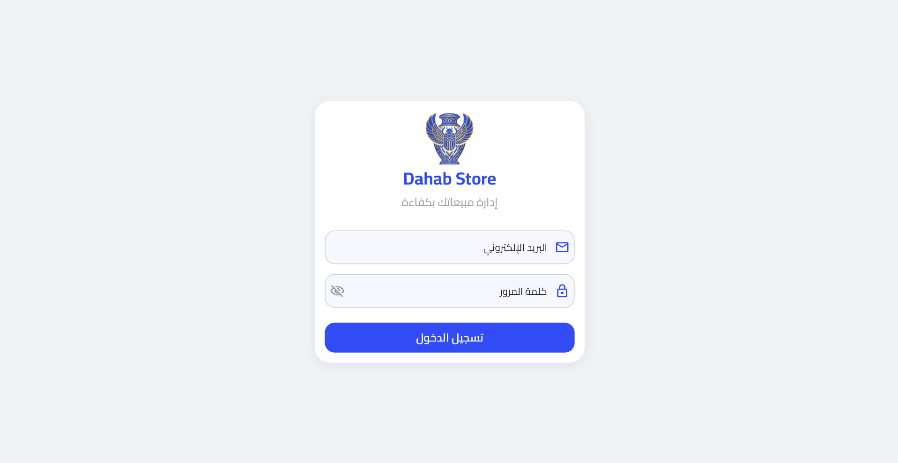
</p>

> Secure login with email and password. Two access levels are supported: **Admin** with full system access, and **Employee** with limited, role-specific permissions.

---

### 🏠 Dashboard

<p align="center">
  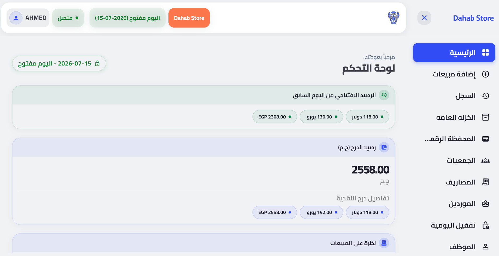
</p>

> The dashboard shows the opening balance carried over from the previous day, the current drawer balance in all currencies, and a quick summary of today's sales — all visible the moment the app opens.

---

### 🛒 Add New Sale

<p align="center">
  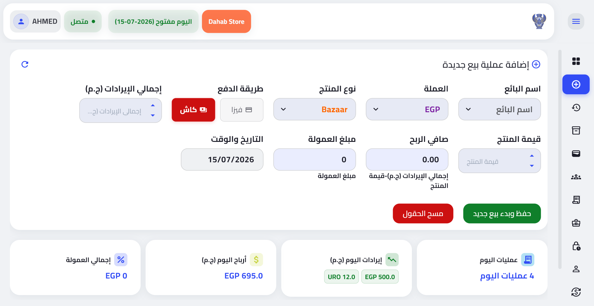
</p>

> A clean sales entry form: select the seller, product type, currency, and payment method (Cash / Visa). The system automatically calculates profit and commission. Today's running totals are displayed at the bottom.

---

### 📊 Sales History

<p align="center">
  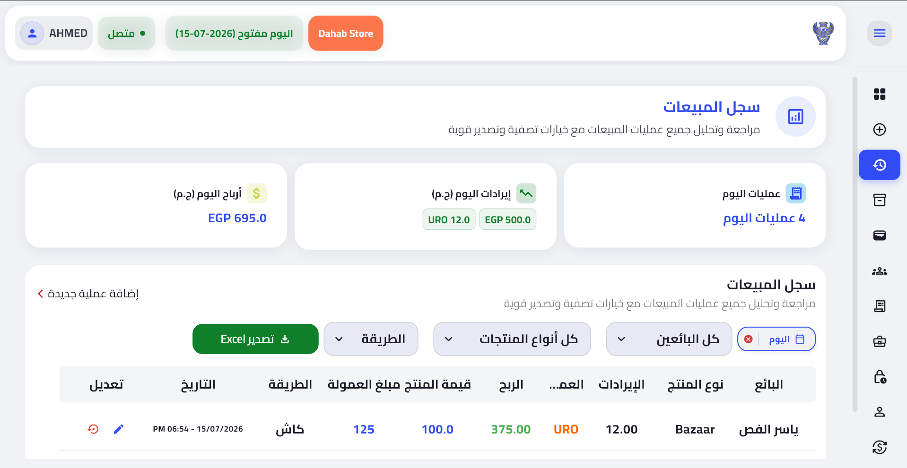
</p>

> A full audit-ready log of all sales transactions. Filter by date, product type, seller, or payment method. Export directly to Excel with a single click.

---

### 🏦 General Vault

<table align="center">
  <tr>
    <td align="center">
      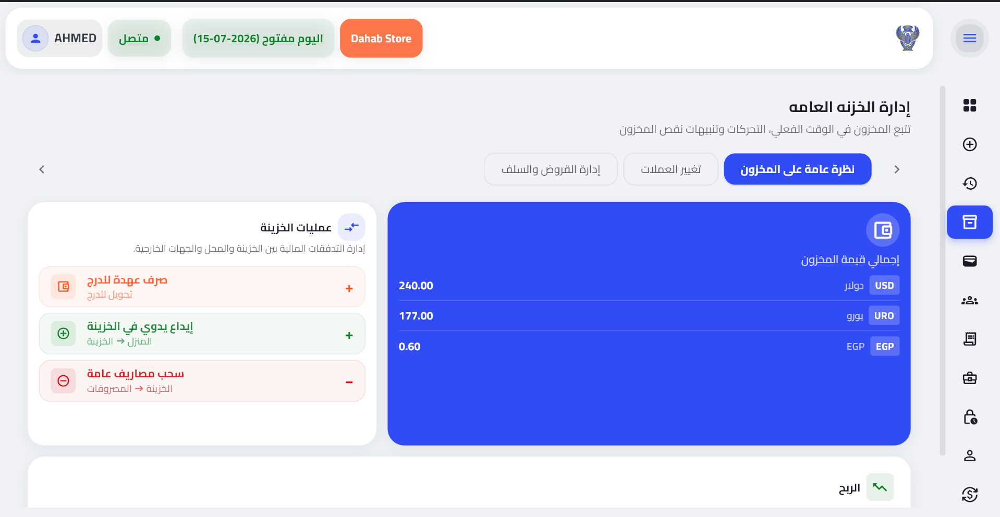
      <br/><sub><b>Vault Overview</b></sub>
    </td>
    <td align="center">
      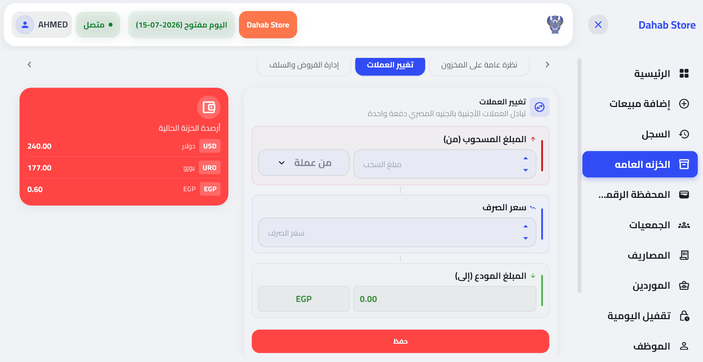
      <br/><sub><b>In-Vault Currency Exchange</b></sub>
    </td>
  </tr>
</table>

> Real-time multi-currency balance tracking (EGP, USD, EUR). Vault operations include: drawer fund disbursement, manual deposits, and general expense withdrawals. Supports in-vault currency conversion at a specified exchange rate.

---

### 💳 Digital Wallet (Visa)

<table align="center">
  <tr>
    <td align="center">
      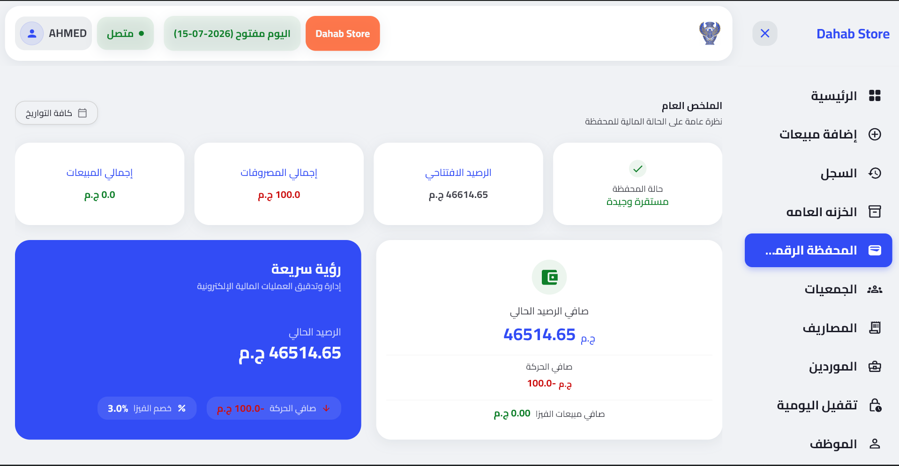
      <br/><sub><b>Wallet Overview</b></sub>
    </td>
    <td align="center">
      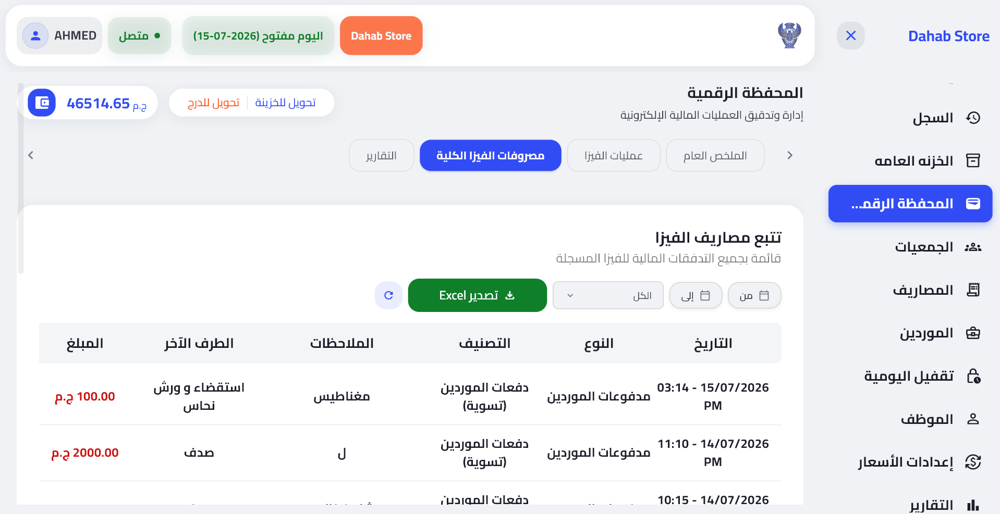
      <br/><sub><b>Visa Expense Log</b></sub>
    </td>
  </tr>
</table>

> Full electronic payment management: track current balance, net movement, and a categorized history of all transfers (supplier payments, expenses, etc.) with Excel export support.

---

### 👥 Savings Groups (Gam3eya)

<table align="center">
  <tr>
    <td align="center">
      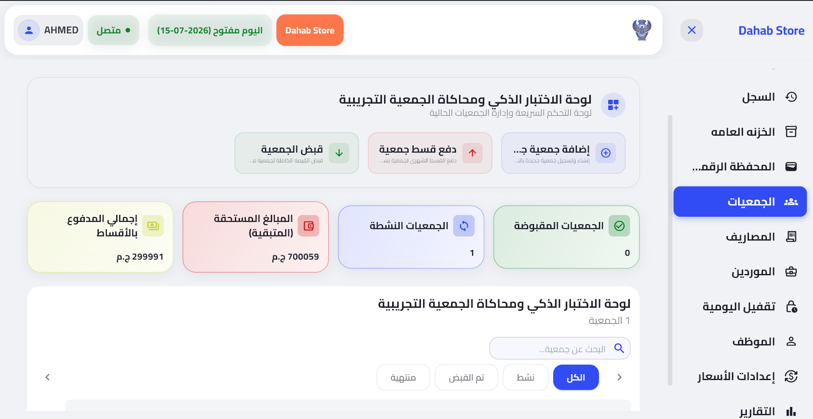
      <br/><sub><b>Groups Dashboard</b></sub>
    </td>
    <td align="center">
      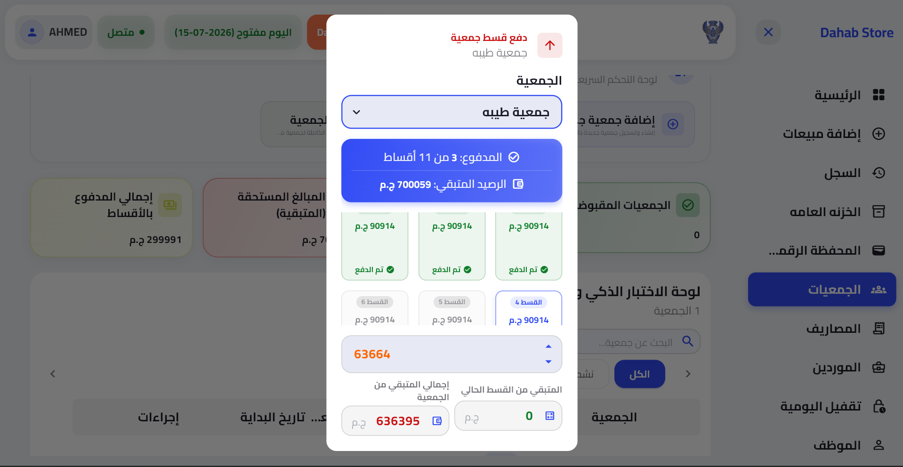
      <br/><sub><b>Pay Group Installment</b></sub>
    </td>
  </tr>
  <tr>
    <td align="center" colspan="2">
      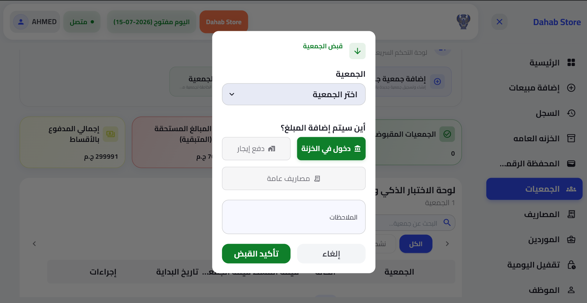
      <br/><sub><b>Collect Group Payout</b></sub>
    </td>
  </tr>
</table>

> A smart financial savings group system: track paid and remaining installments, pay monthly installments with a choice of funding source (vault or rent income), and collect the group payout while designating where the funds should be routed.

---

### 📋 Expenses

<p align="center">
  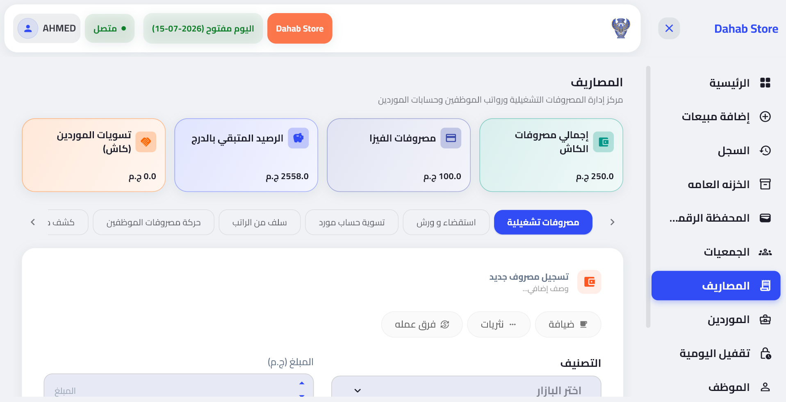
</p>

> Log all operational expenses by category: operational costs, supplier account settlements, salary advances, and employee expense movements. A summary header shows total cash expenses, visa expenses, and supplier settlements at a glance.

---

### 🚛 Suppliers

<table align="center">
  <tr>
    <td align="center">
      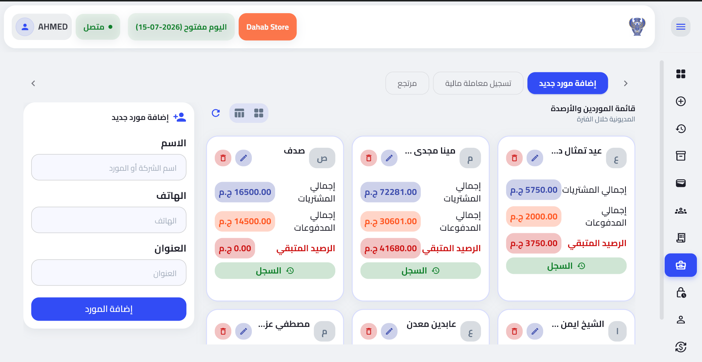
      <br/><sub><b>Supplier Directory</b></sub>
    </td>
    <td align="center">
      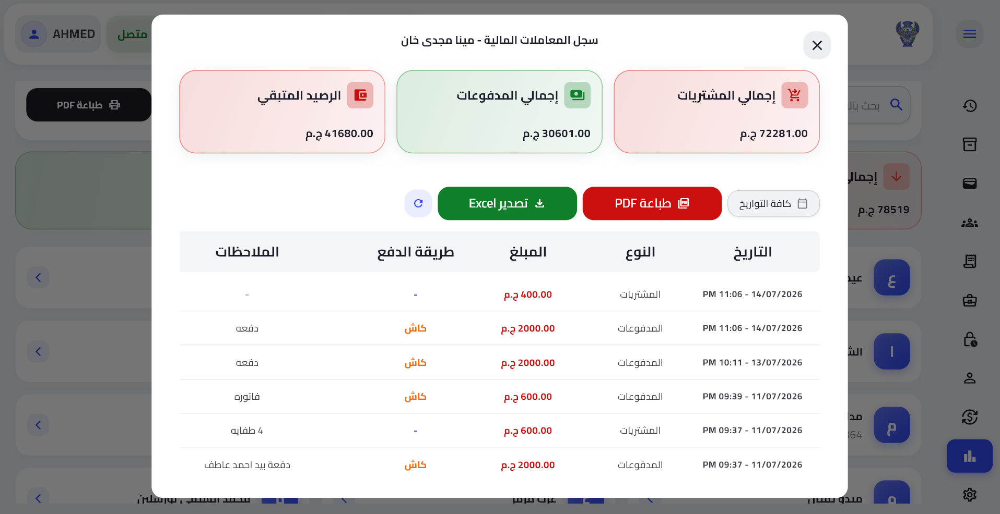
      <br/><sub><b>Supplier Transaction Ledger</b></sub>
    </td>
  </tr>
</table>

> Complete supplier account management: add suppliers, record purchases and payments, track outstanding balances per supplier, and export the full transaction history as PDF or Excel.

---

### 🔒 Daily Closing

<table align="center">
  <tr>
    <td align="center">
      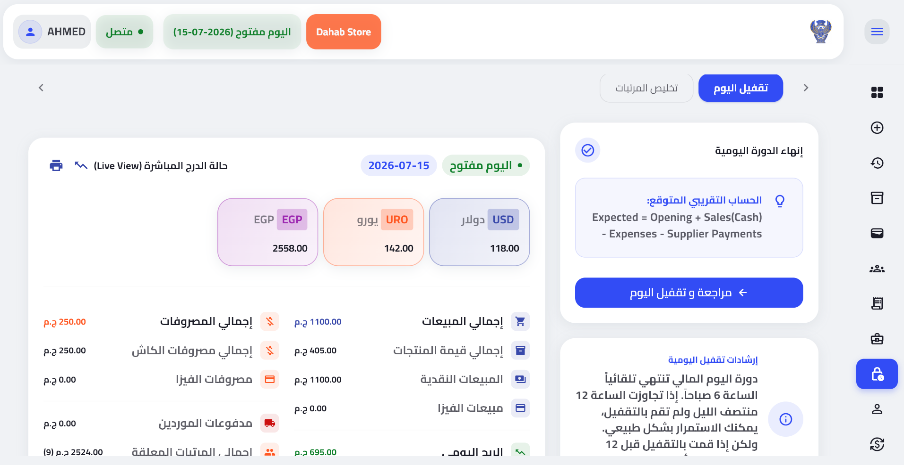
      <br/><sub><b>Closing Screen — Live Drawer View</b></sub>
    </td>
    <td align="center">
      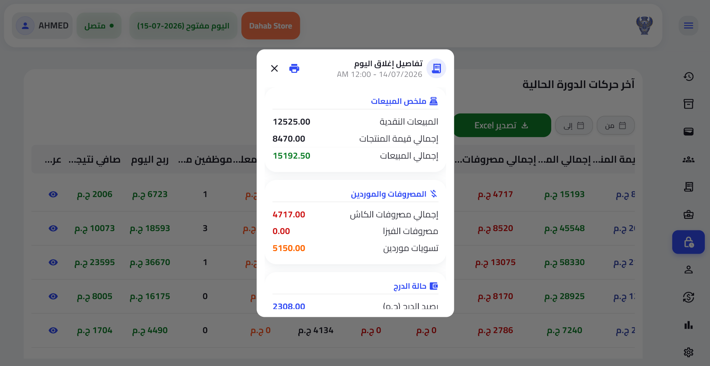
      <br/><sub><b>End-of-Day Summary</b></sub>
    </td>
  </tr>
  <tr>
    <td align="center">
      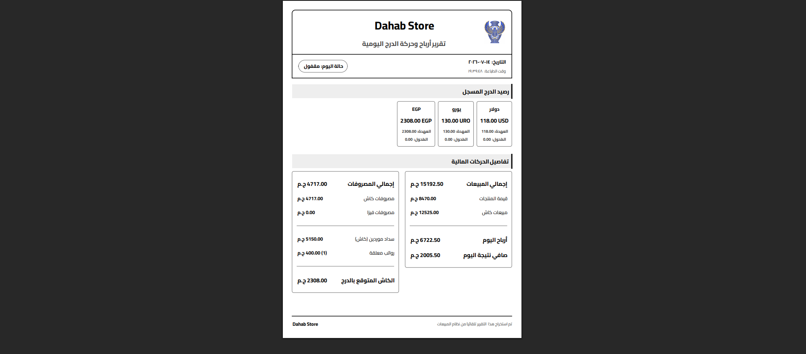
      <br/><sub><b>Generated PDF — Profit & Drawer Report</b></sub>
    </td>
    <td align="center">
      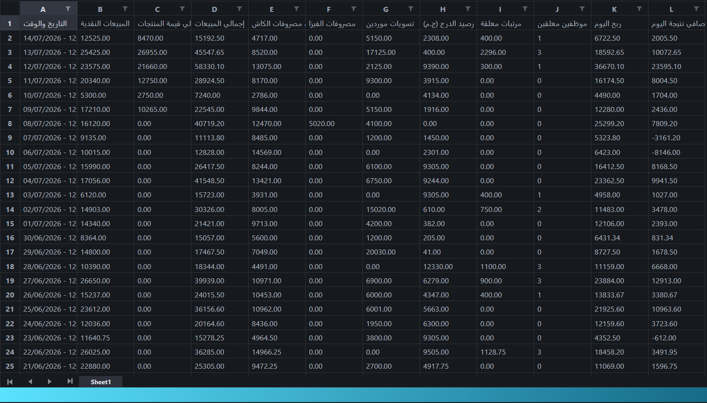
      <br/><sub><b>Excel Export — Historical Daily Log</b></sub>
    </td>
  </tr>
</table>

> The core of the system: at closing time, the app shows a **live drawer view** and computes the expected cash using the formula:
> ```
> Expected Cash = Opening Balance + Cash Sales - Cash Expenses - Supplier Payments
> ```
> It then generates a **PDF report** summarizing sales, expenses, and the final drawer balance — plus an **Excel file** covering the full historical closing log across all past cycles.

---

### 👨‍💼 Employees

<p align="center">
  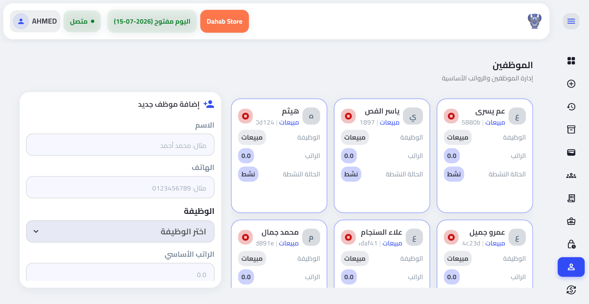
</p>

> Manage employee records: name, phone, job title, base salary, and active status. Each employee receives a unique code used to track their sales performance and salary advances throughout the system.

---

### ⚙️ Price & Rate Settings

<p align="center">
  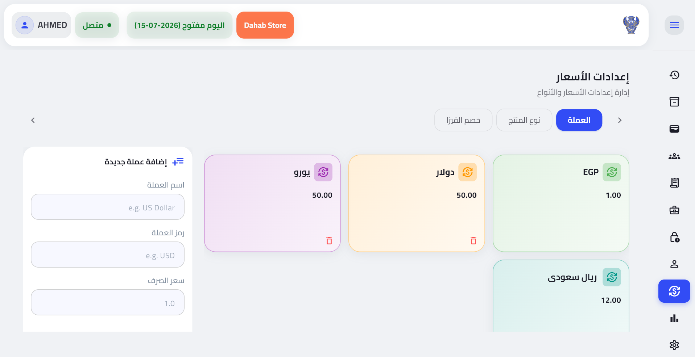
</p>

> Configure supported currencies and their exchange rates (EGP, USD, EUR, SAR), product types, and Visa discount rates — all editable in real-time and reflected instantly across the entire system.

---

### 📈 Reports

<table align="center">
  <tr>
    <td align="center">
      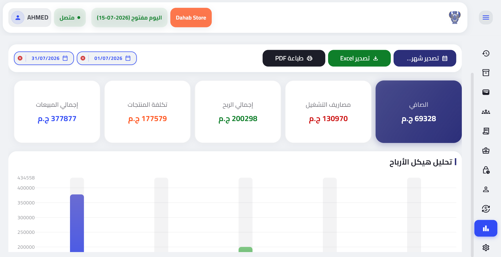
      <br/><sub><b>Monthly Profit Report</b></sub>
    </td>
    <td align="center">
      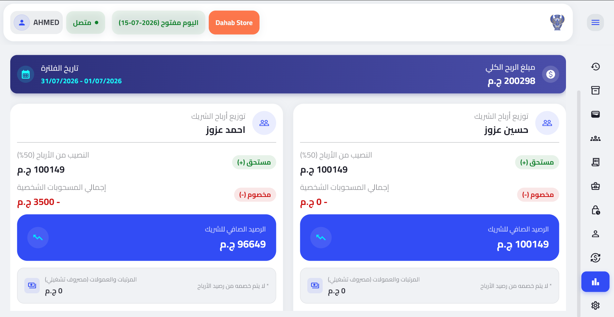
      <br/><sub><b>Partner Profit Distribution</b></sub>
    </td>
  </tr>
  <tr>
    <td align="center">
      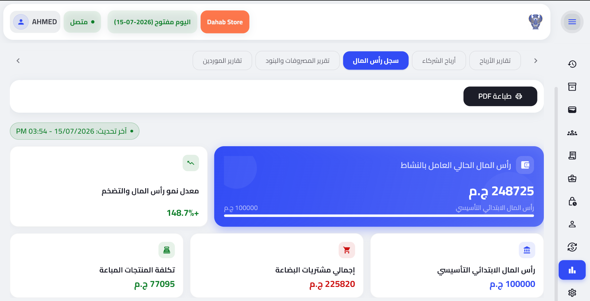
      <br/><sub><b>Capital Summary & Growth Rate</b></sub>
    </td>
    <td align="center">
      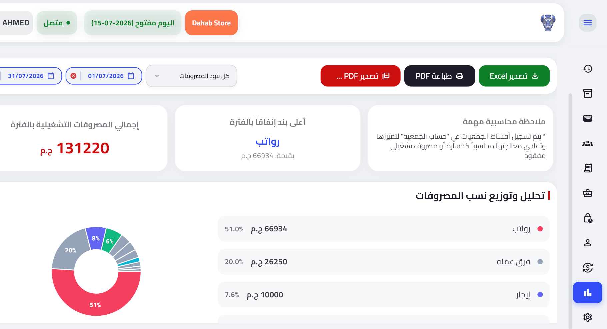
      <br/><sub><b>Expense Breakdown with Charts</b></sub>
    </td>
  </tr>
  <tr>
    <td align="center" colspan="2">
      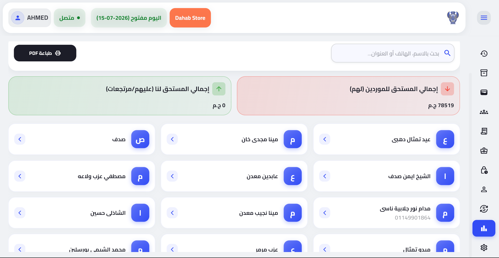
      <br/><sub><b>Supplier Payables Report</b></sub>
    </td>
  </tr>
</table>

> **5 professional financial reports, all exportable as PDF or Excel:**
>
> - 📊 **Profit Report** — Total sales, product cost, operating expenses, and net profit with a profit structure bar chart
> - 👥 **Partner Profits** — Profit distribution across partners by ownership percentage, with personal withdrawals deducted
> - 🏛️ **Capital Summary** — Initial vs. working capital, total purchases, and growth/inflation rate
> - 💸 **Expense Report** — Categorized expense analysis with donut chart showing expense ratios
> - 🚛 **Supplier Report** — Total payables per supplier with search and print support

---

### 👤 User Management

<p align="center">
  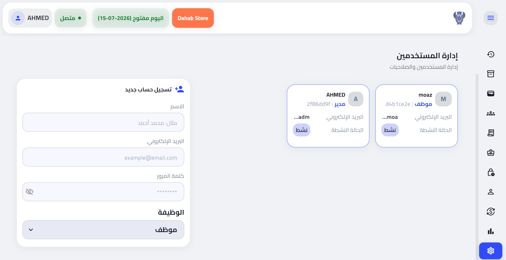
</p>

> Create new user accounts for employees and admins, assign roles (Admin / Employee), and view all existing users with their active status. Permissions are enforced at the database level via Supabase RLS policies.

---

## 🏗️ Technical Architecture

The project strictly follows **Clean Architecture** with a **vertical slice** structure — each feature is fully self-contained across all three layers.

```
lib/
├── core/
│   ├── base/           # BaseState, DataResult, safeDataCall
│   ├── di/             # GetIt + Injectable — dependency graph
│   ├── router/         # GoRouter — AppRouter, RouteNames
│   ├── theme/          # AppColors, AppTextStyles, context extensions
│   ├── localization/   # Localization keys & delegates
│   └── utils/          # AppMeasurements, ConstKeys, helpers
│
└── features/
    ├── auth/
    │   ├── domain/         # AuthEntity, IAuthRepository, LoginUseCase
    │   ├── data/           # AuthModel, AuthRepositoryImpl, RemoteDataSource
    │   └── presentation/
    │       ├── screens/
    │       ├── widgets/
    │       └── view_model/ # AuthViewModel, AuthState, AuthEvents
    │
    ├── sales/
    ├── inventory/
    ├── visa/
    ├── money_pool/
    ├── expenses/
    ├── suppliers/
    ├── daily_close/
    ├── employees/
    ├── reports/
    ├── settings/
    └── user_management/
```

### Architecture Principles Applied

| Principle | Implementation |
|-----------|---------------|
| **Clean Architecture** | Strict unidirectional dependency: Domain ← Data ← Presentation |
| **MVI Pattern** | Each feature has a ViewModel (Cubit) + immutable State + sealed Events |
| **Single Responsibility** | One UseCase per business action |
| **Dependency Injection** | GetIt + Injectable for all ViewModels, UseCases, and Repositories |
| **Repository Pattern** | Interface defined in Domain; implementation lives in Data |
| **No Hardcoded Values** | All sizes via `flutter_screenutil`, all strings via localization, all colors via theme extensions |

### MVI Flow

```
User Interaction
      │
      ▼
doIntent(SomeEvent)        ← only public method on ViewModel
      │
      ▼
_privateHandler()          ← private business logic
      │
      ▼
UseCase.call(params)       ← domain layer
      │
      ▼
DataResult<Entity>         ← success or failure
      │
      ▼
emit(state.copyWith(...))  ← new immutable state
      │
      ▼
BlocBuilder rebuilds UI    ← reactive rendering
```

---

## 🗄️ Database Design

The system uses **Supabase** (PostgreSQL) as the primary backend, with **Row Level Security (RLS)** enforced at the database level for all tables.

### Core Tables

```
┌──────────────────────────────────────────────────────────┐
│  daily_cycles          — Daily financial cycles           │
│  sales                 — All sales transactions           │
│  inventory_snapshots   — Vault balance snapshots          │
│  visa_transactions     — Digital wallet operations        │
│  expenses              — Categorized expense records      │
│  suppliers             — Supplier directory               │
│  supplier_transactions — Supplier payment ledger          │
│  money_pools           — Savings group definitions        │
│  money_pool_payments   — Installment payment records      │
│  employees             — Employee records & salaries      │
│  users                 — App users & roles                │
│  currencies            — Supported currencies & rates     │
│  product_types         — Product category definitions     │
└──────────────────────────────────────────────────────────┘
```

### Data Flow

```
Flutter App
    │
    ▼
RemoteDataSource  ──►  Supabase Client (supabase_flutter)
                              │
                              ▼
                      Supabase PostgreSQL
                      ├── RLS Policies
                      ├── Foreign Key Constraints
                      └── Realtime Subscriptions
    │
    ▼ DataResult<Entity>
RepositoryImpl
    │
    ▼
UseCase  ──►  ViewModel (Cubit)  ──►  State  ──►  UI
```

### Security Model

| Layer | Mechanism |
|-------|-----------|
| **Transport** | HTTPS / TLS on all requests |
| **Authentication** | Supabase Auth — JWT with auto-refresh tokens |
| **Authorization** | Row Level Security (RLS) — users only access their own data |
| **Role Control** | Admin vs. Employee roles enforced in both UI and database policies |

---

## 🛠️ Tech Stack

| Technology | Purpose |
|------------|---------|
| **Flutter 3.x** | Cross-platform UI framework (Desktop / Web) |
| **Dart 3.x** | Programming language |
| **Supabase** | Backend-as-a-Service (Database, Auth, Realtime) |
| **PostgreSQL** | Relational database (via Supabase) |
| **flutter_bloc / Cubit** | State management — MVI pattern |
| **get_it + injectable** | Dependency injection |
| **go_router** | Declarative navigation & routing |
| **json_serializable** | JSON ↔ Dart model code generation |
| **pdf** | PDF report generation |
| **excel** | Excel file export |
| **flutter_screenutil** | Responsive sizing utilities |
| **equatable** | Value-based state comparison |

---

## 👥 Development Team

<div align="center">

This project is developed and maintained by a team of passionate developers:

<br/>

|  |  |  |  |
| :---: | :---: | :---: | :---: |
| **Moaz Osama** | **Youssef Mohamed** | **Anas Hany** | **Bablu** |
| [](https://github.com/moazosama1) | [](https://github.com/youssefmdev22) | [](https://github.com/anashany-shift) | [](https://github.com/Bablu521) |

</div>

---

<div align="center">

*Built with ❤️ using Flutter*

</div>
